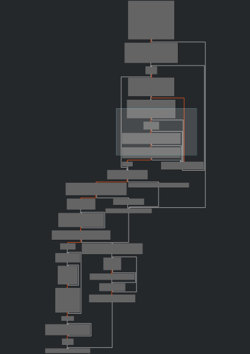

# NFT Bezopasniy Enclave: Write-up

Перед нами статический исполняемый файл — почти все библиотеки, от которых он зависит, встроены прямо в него, а не вызываются из системы. Это слегка мешает исследовать программу, поскольку не всегда можно с лёгкостью сказать, что относится к решению задания, а что не очень.

Из условия задачи и и того, как ведёт себя программа, можно сделать вывод, что она содержит в себе некоторые зашифрованные данные и расшифровывает их, если к ней подключено устройство компании «Агрокекстрой». Давайте откроем его в каком-нибудь дизассемблере.

Видим довольно ветвистый граф:



Попробуем пойти по простому и надёжному пути: патчинг. Для этого последовательно заменим инструкции перед каждым ветвлением: либо на противоположные (например, `JE` (jump if equal) — на `JNE` (jump if not equal)), либо же на `NOP` в случаях, когда нужная ветвь расположена сразу за прыжком.


В какой-то момент дойдём до вызова `fopen` с вряд ли возможно корректным в принципе аргументом `"/dev/mmcblk13"`. Его тоже аккуратно запатчим. Так же поступим с циклом, следующим сразу за ним, в котором файл считывается функцией `getc` — в общем-то, стандартный способ чтения файлов в Си.

После этого программа начнёт печатать в терминале кракозябры. Посмотрим, что это такое:
```
$ ./program | file -
/dev/stdin: GIF image data, version 87a, 362 x 140
```

Ого! Жаль, не не открывается — как будто бы и половиы байтов не хватает.

Давайте немного повтыкаем в ассемблер — вдруг станет понятно. Вот блок, который печатает по символу расишфрованной картинки:


> Можно и не втыкать в ассемблер, а просто поставить точку останова где-нибудь перед концом программы и снять образ памяти, в котором изображение легко найти по заголовку GIF-формата: `GIF87aW`.

Видно, что цикл выполняется `536h = 1334` раз. Сразу перед ним есть цикл, который похож на что-то, что расшифровывает картинку. Он выполняется `14D8h = 5336 = 1334*4` раз. Поправим эту оплошность. Теперь программа печатает картинку как надо:


Флаг: **ugra_kerckhoffs_saw_disassemblers_coming_ea107f7b**
