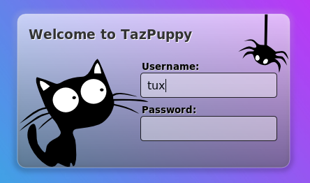
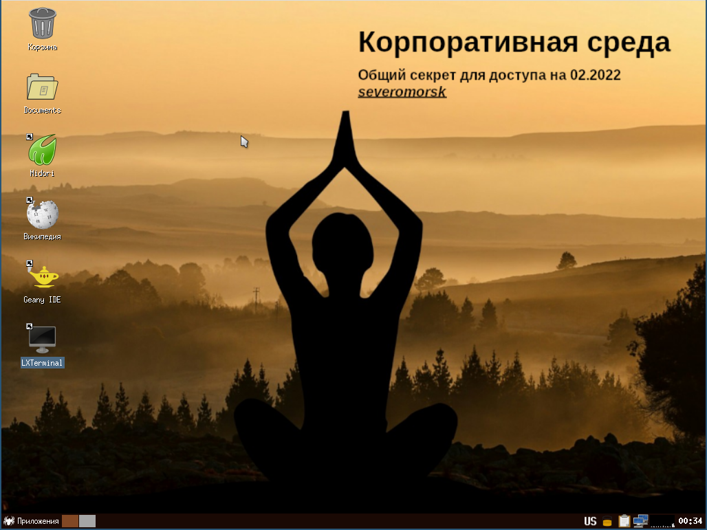
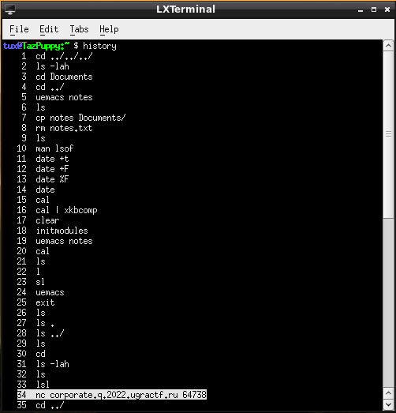

# Прикольная находка: Write-up

Скачиваем файл и начинаем его изучать:
```
$ file neatfind.raw
neatfind.raw: DOS/MBR boot sector; GRand Unified Bootloader, stage1 version 0x3, 1st sector stage2 0x165838
```

Оказывается, флешка-то загрузочная! Пробуем загрузиться с неё в виртуальной машине. Например, в QEMU:
```
$ qemu-system-x86_64 -enable-kvm -hda neatfind.raw
```

Видим экран блокировки:



Надеемся на лучшее (или худшее — тут как посмотреть) и ищем стандартный пароль пользовательской учётной записи в дистрибутиве TazPuppy. Находим их: оказывается, пароля нет! Два раза жмём «Ввод» и видим экран блокировки. Говорят, мы попали в какую-то *Корпоративную среду*.



Секрет с обоины переписываем в блокнотик — на будущее. В попытках зацепиться за что-то перебираем значки на рабочем столе: в браузере пусто, в текстовом редакторе тоже. Зато терминал радует богатой историей команд.



Курсором выделена важная строка о подключении к серверу: `corporate.q.2022.ugractf:64738`. Пробуем подключиться. Спрашивают номер телефона (брелок-то пригодился) и секрет. Дальше не пускают, но флаг дают:

```
ОБНАРУЖЕНА ПОПЫТКА НЕСАНКЦИОНИРОВАННОГО ДОСТУПА К КОРПОРАТИВНОЙ ИНФРАСТРУКТУРЕ.
НАРУШИТЕЛЬ ЗАФИКСИРОВАН. ИНЦИДЕНТ ЗАФИКСИРОВАН.

IP-АДРЕС МЕСТА НАРУШЕНИЯ: [...]
ЛОКАЦИЯ НАРУШИТЕЛЯ: Russia, Yugorsk
ВНУТРЕННИЙ ИДЕНТИФИКАТОР НСД: ugra_every_big_thing_consists_of_many_little_ones_dc399161a8aa
```

> Во время соревнований нам часто поступали письма от участников — мол, флаг неверный. Дело было в том, что система на удалённом сервере требовала в явном виде вводить номер телефона без плюсика, в то время как в условии задачи плюсик-таки был. Система никак его не валидировала, но инциденты всё равно фиксировала. Вот такая притча без морали о человеческой внимательности.

Флаг: **ugra_every_big_thing_consists_of_many_little_ones_dc399161a8aa**
