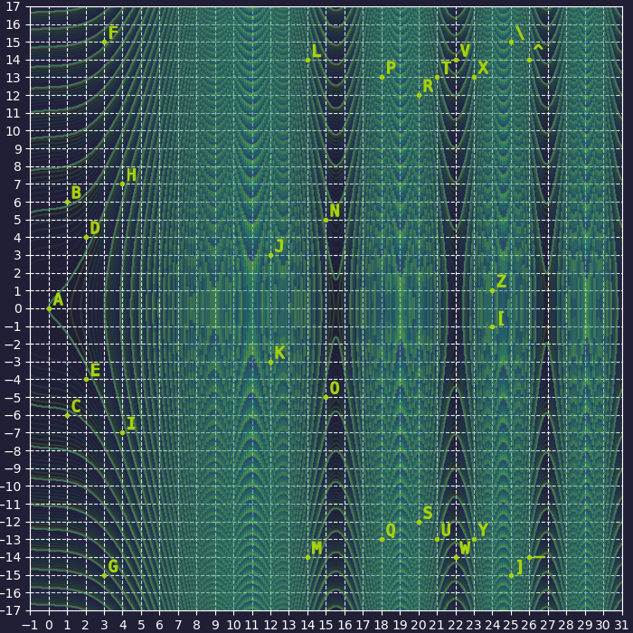

# noteasy03: Write-up

Задание noteasy03 — продолжение давней югорской традиции: давать флаг, зашифрованный [каким-нибудь](https://github.com/teamteamdev/ugractf-2019-quals/tree/master/tasks/noteasy) [шифром](https://github.com/teamteamdev/ugractf-2021-quals/tree/master/tasks/noteasy82) [простой](https://github.com/teamteamdev/ugractf-2019-finals/tree/master/tasks/noteasy3) [замены](https://github.com/teamteamdev/ugractf-2020-quals/tree/master/tasks/noteasy5), и говорить загадками.

В этот раз нам дают график какой-то довольно сложной кривой, некоторым точкам которой сопоставлены символы алфавита. Если некоторое время поизучать, что вообще бывает в криптографии, то рано или поздно вы наткнётесь на эллиптические кривые. Или, возможно, они уже встречались вам. Как бы там ни было, на графике изображена именно такая кривая:



В криптографии, как правило, работают с конечными полями — всегда «берут» все числа по модулю, проще говоря. Поэтому кривая в данном случае задаётся уравнением вида:

<p align="center"><i>y</i>² = <i>x</i>³ − <i>ax</i> + <i>b</i> (mod <i>r</i>)</p>

## Определяем параметры

Как видно, у такой кривой есть три параметра: *a,* *b* и *r*.

Начнём с простого. Из школьного курса алгебры известно, что параметр *b* отвечает за смещение графика по оси *Oy*. Наш же график симметричен, следовательно, кривая никуда не смещена — то есть параметр *b* равен нулю.

Теперь *r*, порядок конечного поля, то есть число элементов, из которых оно состоит. Логично предположить, что порядок поля, на котором задана кривая, совпадает с мощностью алфавита шифра. Посчитаем точки на графике: их 31 штука — это число к тому же простое, а криптографы, как известно, просто обожают брать модули по простым числам. Берём!

Остался лишь один параметр, и это *a*. Его вполне реально подобрать. Для этого можно поступить вот как.

Сперва выпишем все точки, которые у нас есть:

| Символ | Точка     | Символ | Точка     |
|-------:|-----------|-------:|-----------|
| A      | (0, 0)    | Q      | (18, -13) |
| B      | (1, 6)    | R      | (20, 12)  |
| C      | (1, -6)   | S      | (20, -12) |
| D      | (2, 4)    | T      | (21, 13)  |
| E      | (2, -4)   | U      | (21, -13) |
| F      | (3, 15)   | V      | (22, 14)  |
| G      | (3, -15)  | W      | (22, -14) |
| H      | (4, 7)    | X      | (23, 13)  |
| I      | (4, -7)   | Y      | (23, -13) |
| J      | (12, 3)   | Z      | (24, 1)   |
| K      | (12, -3)  | [      | (24, -1)  |
| L      | (14, 14)  | \      | (25, 15)  |
| M      | (14, -14) | ]      | (25, -15) |
| N      | (15, 5)   | ^      | (26, 14)  |
| O      | (15, -5)  | _      | (26, -14) |
| P      | (18, 13)  |        |           |

Затем возьмём какое-нибудь *a*, а также координаты *x* и *y* каждой точки и будем проверять, выполняется ли в них во всех равенство, которым задаётся кривая. Переберём, например, на Питоне:

```python
POINTS = [(0, 0), (1, 6), ..., (26, -14)]
B = 0
R = 31

for a in range(-100, 101):
    for point in points:
        x, y = point
        left  = pow(y, 2) % r # левая часть уравнения
        right = (pow(x, 3) + a*x + b) % r # ...правая
        if left != right:
            break
    else:
        print(f"All points are on curve for a = {a}")
        break
```

В этом случае *a* равно четырём, но вообще, у каждой команды этот параметр был разным.

Ура, с кривой разобрались.

## Криптографический анализ

Давайте ненадолго отвлечёмся на хаику, приложенное к заданию:

> _Цезарь скривился,_  
> _Замкнулся в себе._  
> _Преумножение._  

Ёмкость произведений в этом уникальном поэтическом жанре порой захватывает дух. Этот конкретный стишок, конечно, ни на что художественное не претендует, но всё же намёков из него можно извлечь достаточно:

| Намёк          | Предполагаемая интерпретация                                                                                                  |
|----------------|-------------------------------------------------------------------------------------------------------------------------------|
| `Цезарь`       | Шифр простой замены. Возможно, присутствует число 3 (классический шифр Цезаря подразумевает свдиг именно на столько позиций). |
| `Замкнулся`    | Модульная арифметика.                                                                                                         |
| `в себе`       | н/д                                                                                                                           |
| `Преумножение` | Основа шифра — операция умножения.                                                                                            |

Цезарь — это когда букву превращают в порядковый номер, прибавляют три, и превращают порядковый номер обратно в букву: `chr(ord('A') + 3) # 'C'`. [Сложение точек на эллиптических кривых](https://en.wikipedia.org/wiki/Elliptic_curve_point_multiplication#Point_addition) действительно определено, но только оно не совсем тут подходит: что прибавлять-то? (3, 0)? (3, 3)? Какая-то угадайка — точно не то. Умножение точек тоже определено, и там как раз можно умножать на целые числа — повторно складывать точку столько раз, какой величины число. Да и намёк на умножение присутствует.

Предположим, что все точки действительно взяли и умножили на одно и то же число (на 3 или нет — не так важно, поле конечное, а, следовательно, пространство перебора крайне небольшое). Получается, надо просто взять и разделить всё на какое-то число. Делается это путём умножения точки на число, обратное делителю (*a* ÷ *b* = *a* × *b*⁻¹).

Давайте попробуем.

## Практическая часть

> Эту часть можно читать по диагонали. Если вы не хотите вникать в нюансы, воспользуйтесь готовой библиотекой для работы с эллиптическими кривыми. Например, [PyECCArithmetic](https://github.com/Kavakuo/PyECCArithmetic).

Адаптируем формулу сложения из «Википедии». Почему для сложения используется несколько случаев лучше понять, если разобраться с геометрическим смыслом сложения таких точек. Но райтап и без того затянулся, поэтому покажу сразу код:
```python3
POINTS = [(0, 0), (1, 6), ..., (26, -14)]
B = 0
R = 31
A = 4


def ec_add(p1, p2):
    x1, y1 = p1
    x2, y2 = p2
    if x1 == x2: # точки на одной прямой линии...
        if y1 != y2 or y1 == 0: # ...но это разные точки...
            return (None, None) # получается точка (∞, ∞)
        else: # ...и это одна и та же точка
            l = (3 * pow(x1, 2) + A) * pow(2 * y1, -1, R) % R
    else: # ...и это вообще разные точки
        l = (y2 - y1) * pow((x2 - x1), -1, R) % R
    x3 = (pow(l, 2) - x1 - x2) % R
    y3 = (l * (x1 - x3) - y1) % R
    return (x3, y3)
```

Теперь умножение и «деление»:
```python3
def ec_mul(p, n):
    result = (0, 0)
    for i in range(n):
        result = ec_add(result, p)
    return result


def ec_div(p, n):
    return ec_mul(p, pow(n, -1, R))
```

## Проверка всех догадок

Дело за малым. Сконвертируем шифртекст из символов в соответствующие точки. Разделим каждую точку на три. Сконвертируем получившиеся точки обратно. Может ничего не получиться.

Дело в том, что координаты точек, которые вычислит скрипт выше, будут неотрицательными, в то время как на графике точки бывают всякие. Вспоминаем про модульность арифметики и каждую точку после деления преобразуем по правилу:
```python3
if y > (R // 2):
    y -= R
```

Флаг: **ugra_in_case_of_losing_your_sanity_dial_oh_three_bgkdahjoffifoljflcnkg**
