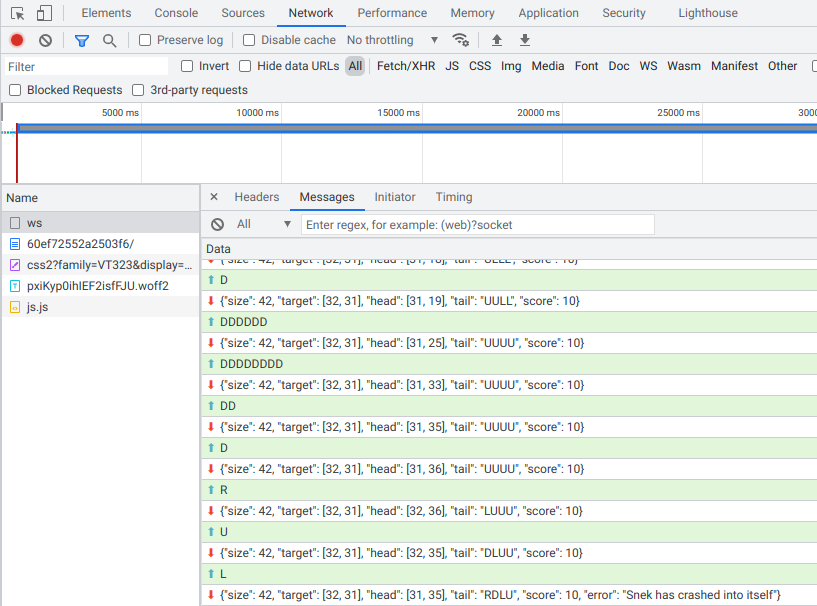
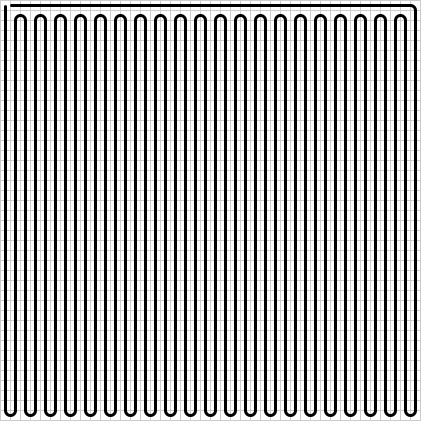
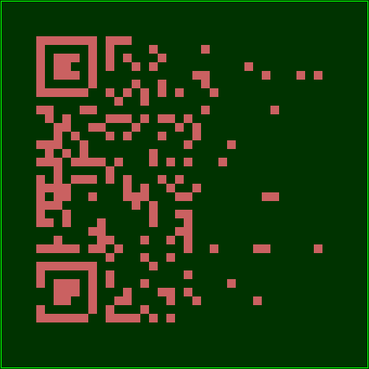
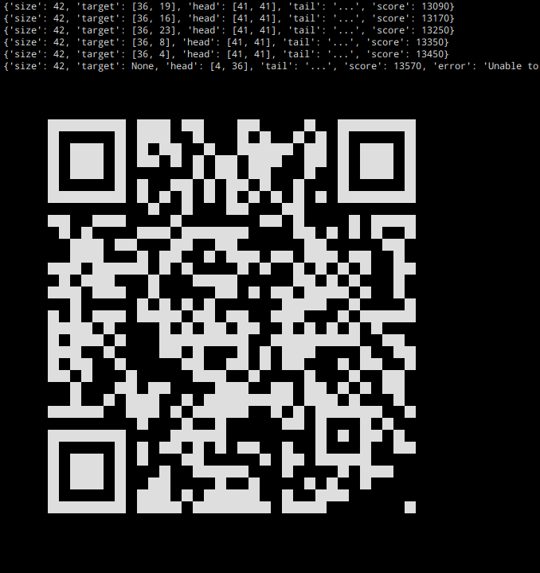

# Разборчивая змейка: Write-up

Классическая игра в змейку идёт на поле 42×42, за каждое приращение даётся 10 очков. Чтобы повторить указанный на странице рекорд в 17600 очков, придётся заполнить змейкой всё поле наглухо.

Делать это, конечно, лучше не вручную.

Для начала разберёмся, как устроена игра. Открываем инспектор браузера, в нём — вкладку Network, видим там открытый вебсокет и сообщения в нём. По-всякому играем, чтобы понять, что бывает.



Вроде всё понятно. Отправляем строчки с движениями (буквы U, L, D, R — up, left, down, right), получаем в ответ JSON с данными про положение целевой точки на поле, расположение самой змейки и счёт; если проиграть, там же будет сообщение об ошибке.

Важно заметить:
* Можно посылать несколько движений в одном сообщении
* Сервер лишь реагирует на посланные нами движения, но сам змейку не двигает
* Тикающее время на странице не участвует в обмене данными с сервером, а значит, ни на что не влияет

Дальше можно было бы реализовать какой-нибудь умный и оптимальный алгоритм игры, но поскольку ходов можно делать сколько угодно, поступим проще. Выведем змейку в угол поля (например, левый верхний) и будем бесконечно гонять её замкнутым зигзагом, покрывая все точки поля. Где бы ни находилась цель, змейка до неё рано или поздно дойдёт без столкновений. Если повезёт, за один круг можно будет встретить цель даже несколько раз.



Этой траектории соответствует строка D D…D R U…U R D…D R U…U R … D…D R U…U U L…L.

Наберёмся наглости и будем тупо посылать одну и ту же зацикленную траекторию бесконечно, пока игра не закончится.

```python
TRAJECTORY = "D" + (("D"*40 + "R" + "U"*40 + "R") * 21)[:-1] + "U" + "L"*41

async with aiohttp.ClientSession() as ss:
    ws = await ss.ws_connect("wss://snekpeek.q.2022.ugractf.ru/cb8ed0507e65de8a/ws")
    await ws.receive()
    await ws.send_str("U"*28 + "L"*28)
    while True:
        msg = await ws.receive()
        print({**msg.json(), "tail": "..."})
        await ws.send_str(TRAJECTORY)
```

Но игра всё не заканчивается и не заканчивается. Вернее, заканчивается, но почему-то всегда раньше, чем нам хотелось бы, и с вот такой ошибкой:

```javascript
{"size": 42, "target": null, "head": [36, 36], "tail": ..., "score": 13410,
 "error": "Unable to place new target because all permitted target locations are already occupied by snek"}
```

Получается, есть какие-то области, в которых цель появляться не может. Попробуем запоминать в ходе игры и потом отметить на поле все места, где мы когда-либо видели цель — вдруг что-то станет понятно.



Явно угадывается QR-код, но какой-то неполноценный и уж точно не распознающийся. Точки в его правой части собрались хуже, чем в левой. Набрать недостающие точки можно разными путями — например, сыграть второй раз, перевернув траекторию на 180°. Или отправлять траекторию небольшими кусочками, чтобы успеть заметить побольше возможных расположений цели. Или начинать игру много раз и доигрывать до небольшого счёта. В ряде случаев может потребоваться дорисовать служебные области QR-кода.



[Полный эксплоит](writeup/exploit.py)

Флаг: **ugra_[i_specifically_requested_the_opposite_of_this](https://www.google.com/search?tbm=isch&q=i+specifically+requested+the+opposite+of+this)_9e866bcf53ac**

## Постмортем

В первый день соревнований в сокет можно было послать только одну команду на перемещение за раз. Это делало решение хоть и не невозможным, но существенно более долгим (порядка нескольких часов на один прогон до упора), при этом разрыв соединения приравнивается к проигрышу и требует начинать сначала. После изменений один прогон стал занимать порядка минуты.
