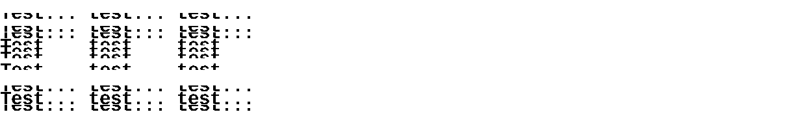

# Термопринтер: Write-up

Итак, нам надо сформировать .prn-файл с нужными данными, опираясь на уже существующий пример и драйвера.

Для начала поэкспериментируем с самим файлом. Если поискать в интернете начальные байты — [1D 76 30](https://www.google.com/search?q=%221d+76+30%22), примерно все результаты будут про термопринтеры. Оттуда мы узнаем, что протокол называется ESC/POS, а эти три байта образуют заголовок одной из возможных команд печати растрового изображения. И действительно, эти же байты встречаются в файле ещё три раза.

Даже без изучения внутренней структуры команд можно попробовать попереставлять их, поотправлять их несколько раз. Убеждаемся, что каждая команда отвечает за тонкую горизонтальную полоску из итоговой картинки. Также можем убедиться, что все данные за пределами команд ни на что не влияют, таким образом, больше ничего, кроме этих команд, в файле нет. При этом малейшее изменение данных внутри команды приводит к тому, что из «распечатанной» картинки пропадает целая полоска — по-видимому, некорректные команды «принтер» игнорирует.



В [первом результате](https://stackoverflow.com/questions/32155472/print-bitmap-to-esc-pos-printer) нашего поиска приведено некое описание команды.

> Hex 1D 76 30 m xL xH yL yH d1....dk
>
> <...>
>
> xL, xH, select the number of data bits ( xL+ xH × 256) in the horizontal direction for the bit image.
>
> yL, yH, select the number of data bits ( yL+ yH × 256) in the vertical direction for the bit image.
>
> <...>
>
> d indicates the bit-image data. Set time a bit to 1 prints a dot and setting it to 0 does not print a dot.

Смотрим в файл. В нашем случае m = 0 (режим «печати» без удвоения пикселей), xL xH образуют число 50, yL yH — число 10 (в последней команде — 8).

Ширина 50 выглядит странно, потому что ширина области, «печатаемой» командой, больше, раз примерно в восемь. Это наводит на мысль, что ширина на самом деле почему-то задаётся в байтах. Опять же, можно поменять это число на, например, 100, и посмотреть, как поведёт себя «принтер».


При числе 100 «распечатанные» данные занимают примерно 800 пикселей, то есть ширину из команды действительно нужно умножать на 8. Ну допустим.

Но дальше начинается удивительное: после ширины и высоты дальше должны идти непосредственно байты картинки, причём размер блока данных явно не указывается и, судя по всему, зависит от ширины и высоты. Но при одинаковой ширине и высоте команды явно разной длины, и байт в них явно меньше, чем было бы нужно, чтобы заполнить указанную область. А ещё, стоит поменять хоть один бит — и полоска пропадает целиком, хотя если бы это были биты картинки, должна была поменяться лишь небольшая область.

Наверное, куски картинки как-то сжаты.

Пришло время поковыряться в драйверах. В задании нам почему-то рекомендуют обратить внимание на драйвер для Мака. Открываем архив, находим там неинтересные .ppd.gz со всякими метаданными на английском и китайском языках, и два исполняемых файла.

```bash
$ file usr/libexec/cups/filter/*
usr/libexec/cups/filter/raster-mt800:  Mach-O 64-bit x86_64 executable, flags:<NOUNDEFS|DYLDLINK|TWOLEVEL|PIE>
usr/libexec/cups/filter/raster-poooli: Mach-O 64-bit x86_64 executable, flags:<NOUNDEFS|DYLDLINK|TWOLEVEL|PIE>
```

Судя по названию модели принтера, нас интересует второй из этих файлов. Разобраться в нём нам поможет Ghidra. Создадим новый проект и импортируем туда исполняемый файл, не трогая никаких настроек и игнорируя предупреждения.

Ищем (_Search_ → _Memory_), где в программе встречаются байты 1D 76 30 (должна же она их использовать, формируя команду). Таких мест оказывается всего три, два из них приводят нас к функции с говорящим названием `_print_bitmap`.

Внутри декомпилированного кода видим вызов функции `_lzo1x_1_compress`. Наша догадка про сжатие подтвердилась, осталось лишь разобраться в деталях того, как формируются данные. Функция `_lzo1x_1_compress` принимает в качестве предпоследнего аргумента указатель на переменную `local_58`, куда записывает итоговый размер сжатых данных. Она затем преобразуется в тип `int` и записывается в файл. И действительно, если мы рассмотрим первые четыре байта блока данных как число, задающее длину, то ровно столько байт и будет после него и перед началом следующей команды.

Чтобы не разбираться в нюансах инициализации алгоритма — параметрах функции `___lzo_init_v2`, попробуем просто распаковать сжатые данные.

```python3
import lzo
prn = open("test-test-test.prn", "rb").read()
lzo.decompress(prn[12:12+35], header=False, buflen=1000000)
```

Заголовок LZO в данных отсутствует, потому что при `header=True` возникает ошибка распаковки, а при `header=False` мы не получаем ошибок, но получаем данные, похожие на те, которые в итоге «печатаются».

Попробуем теперь брать полоски из нашей целевой картинки и формировать команды. Сжатие `lzo.compress` нужно делать с параметром `level=1` (для других уровней сжатия драйвер вызывал бы не `_lzo1x_1_compress`, а другую функцию).

```python3
import lzo
import PIL.Image
import struct
import sys

HEIGHT_DELTA = 10
image = PIL.Image.open("thermal-printme.png")

out_file = open("out.prn", "wb")

for y in range(0, image.size[1], HEIGHT_DELTA):
    bits = ""
    for cy in range(y, min(image.size[1], y + HEIGHT_DELTA)):
        for cx in range(0, image.size[0]):
            if image.getpixel((cx, cy)) == 255:
                bits += "0"
            else:
                bits += "1"
    bits += "0" * ((8 - len(bits) % 8) % 8)

    data = int(bits, 2).to_bytes(len(bits) // 8, byteorder="big")
    z_data = lzo.compress(data, 1, False)

    out_file.write(b"\x1Dv00")
    out_file.write(struct.pack("<hh", image.size[0] // 8, min(image.size[1] - y, HEIGHT_DELTA)))
    out_file.write(struct.pack("<L", len(z_data)))
    out_file.write(z_data)
```

Отправим этот файл на «печать». Рядом с «напечатанной» картинкой, если всё сделано правильно, на странице выводится флаг.

Флаг: **ugra_esc_pos_goes_lprrrrrrrr_5604ef89a7a6**
