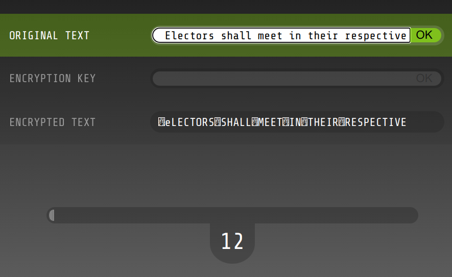

# Хохорейсинг: Write-up

Предлагается игра: нужно придумать какой-нибудь ключ шифрования, получить зашифрованный им текст и угадать, что же было зашифровано, пока не истекло время. После ввода своего варианта игра показывает, какой был правильный ответ.

Немного поиграв вхолостую, можно обратить внимание, что:

* Оригинальный текст — всегда несколько слов на английском языке
* Длина текста всегда одинаковая — 40 символов; текстовые поля тоже предлагают ввести до 40 символов
* Непечатные символы в зашифрованном тексте заменяются изображением, восстановить их невозможно
* Шифрование побуквенное: одна и та же буква исходного текста при одной и той же букве ключа соответствует одной и той же букве зашифрованного текста

Последний факт (а также намёк в названии игры) приводит к выводу, что шифрование — не что иное, как операция XOR над текстом и ключом.

Если бы указывали в качестве ключа нулевые байты, текст в процессе шифрования не изменялся бы. Однако простого и удобного способа отправить такой ключ нет, поэтому можно подумать, как ограничиться символами, доступными с клавиатуры.

Операция XOR тем сильнее меняет текст, чем больше в ключе двоичных единиц. Меньше всего единиц из доступных нам символов в пробеле (код 32 = 00100000₂) и собаке (код 64 = 01000000₂).

По счастью, стандартная кодировка букв устроена так, что коды заглавных и строчных английских букв отличаются ровно на 32. Значит, если выбрать в качестве ключа строку из пробелов, то заглавные буквы превратятся в строчные, строчные — в заглавные, а пробелы — в непечатный символ с кодом 0. Это позволит по такому «зашифрованному» тексту без труда восстанавливать оригинал в уме.

Получается стратегия игры: в качестве ключа всегда вводить (или вставлять из буфера обмена) 40 пробелов, после чего аккуратно перепечатывать текст с противоположным регистром. После каждого успешно сыгранного раунда внизу открывается несколько букв флага. Сыграв 15–20 раз, можно получить флаг целиком.

Флаг: **ugra_go_go_go_come_on_yes_yes_a_bit_more_just_a_little_400f02858d7c656**
